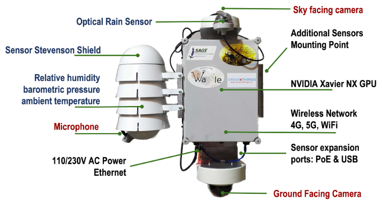
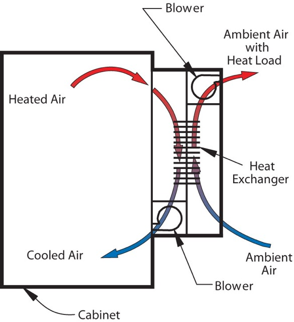
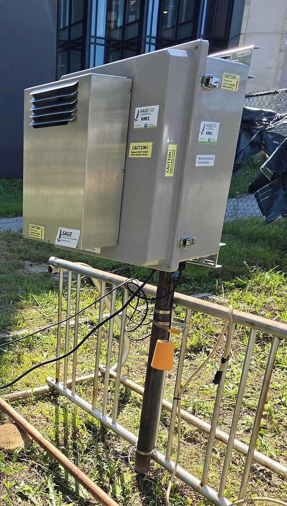
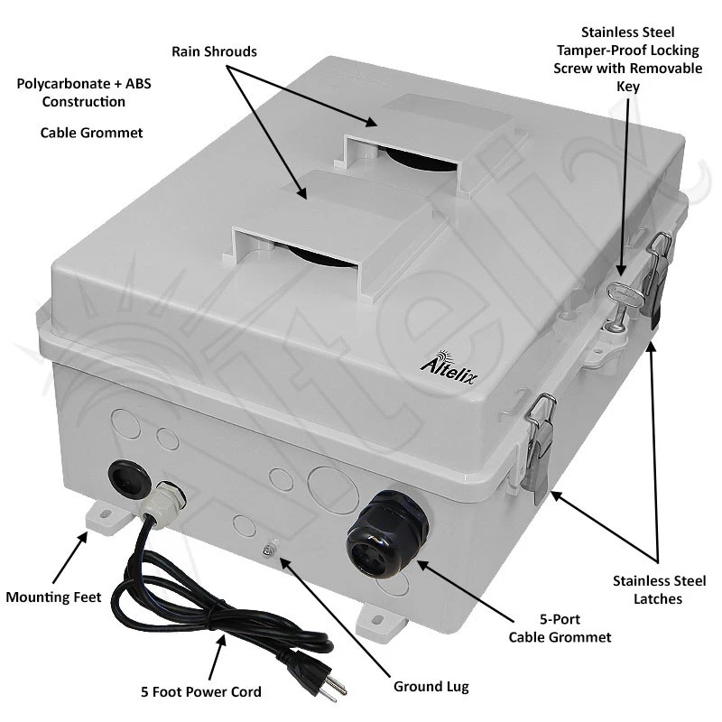
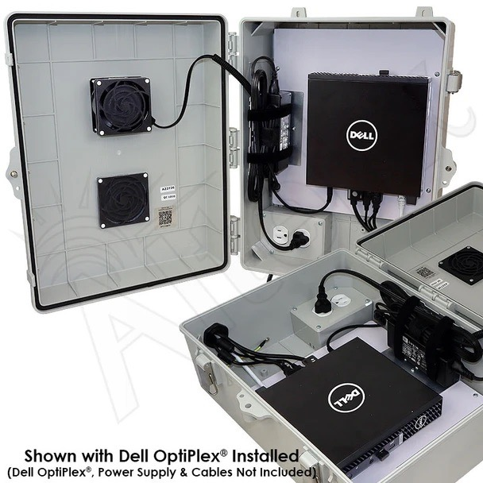
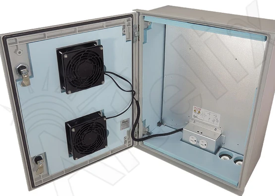
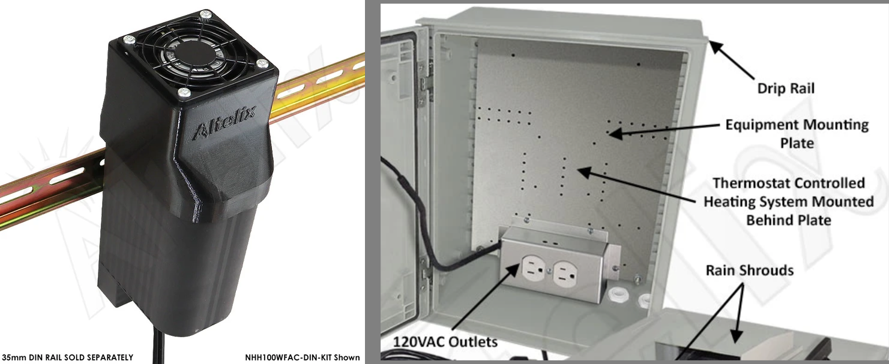

# Wild Sage Node Design Study

Wild Sage Nodes (WSN) live outdoors and need a weatherproof enclosure..

The goal of this design study is to gain experience with commodity weatherproof computer enclosures to inform and guide the selection of key parameters for a final design that balances manufacturability (including complexity, timeline, sourcing, etc.), reliability, serviceability, functionality (runs Sage workloads well for our locations), and cost. 

Ideally, final designs would support a wide range of deployment sites and configurations while also balancing design constraints.

**Methodology**:  Build three to five real prototypes, using several different commodity enclosures and technologies, and gather experience, data, and insights to guide the selection of key design requirements, parameters, and components.

**Core components**: The basic WSN building block is simple:

+ Power supply
+ NVIDIA Thor on an AVerMedia carrier
+ Power distribution unit (PDU)
+ Gateway router

**Environmental expectations**:

+ Operating temperature range: -20C to 40C (outdoor temperature)
+ Non-operating (storage) temperature range: -40C to 100C
+ Operating relative humidity: 20% - 95%
+ Solar gain: high plains of Colorado
+ Internal heat from electronics: ~170W

## Enclosure Technology

Broadly, enclosures for electronics fall into several well-understood categories. A short overview of each of the approaches, along with the advantages, disadvantages, and challenges, is described below. 

### Sealed - Passive Cooling

The previous WSNs used sealed, passive cooling.  That classic design was both very functional and resilient. The enclosure supported the Jetson NX GPU.  The watertight box used a small PTFE port to equalize pressure and average humidity.

Heat is dissipated via the skin -- the total surface area of the enclosure.  This method works well when the ratio of dissipated heat is small compared to the enclosure size.  Such is often the case with a sealed PTZ camera or small network switch mounted in a waterproof enclosure.  The heat from the electronics inside is easily dissipated to the external surface.  The previous WSN was at the limit of cooling for the box size.  When there was significant solar gain, such as in Texas, the box became too warm.  Making the enclosure larger increases the solar gain, and the effectiveness of increasing the surface area to provide cooling diminishes.

For ~170W Thor nodes, an enclosure would need to be "comically large" (and therefore impractical) to dissipate heat via the surface area of the enclosure.  

**Advantages**: Very simple for low-power devices.  Maintenance free.

**Disadvantages**: Impractical for the more powerful Thor design point.  

### Sealed - Active Cooling

Commercial products exist for cooling enclosures by incorporating a heat exchanger (HX).  An air-to-air HX is simple.  It is also a commonly deployed technology.  The sealed electronics compartment (often NEMA 4X rated) shields the electronics from harmful environments such as marine/coastal (Hawaii), agriculture fertilizer, sulphuric vapors (volcanoes), etc.  The HX can be designed to withstand the harsher external environment while providing cooling to the sealed enclosure.

The diagram below shows the overall design of HX systems.  

An example of this style of commodity product is the [Stratus line of HX units](encstratusheatexchangers.pdf) that can be attached to existing enclosures.  **BigBoy** (K001), an experimental system to explore the cooling from a 44W/C compact HX, is pictured below.

As an active cooling solution, the HX fan must cycle on and off based on the internal enclosure temperature.  The most common commodity solution is a thermostat with a physical set point (dial) to select a temperature.  For BigBoy (V1.0), we are using the PDU to activate the HX fan based on a software algorithm that reads the internal enclosure temperature from a sensor.

**Advantages**: Provides *very effective* active cooling to a sealed enclosure.

**Disadvantages**: Costly, requires custom modification to the selected enclosure to mount the HX.  By itself, the HX only provides cooling, not active dew point/condensation management.  Requires periodic maintenance and cleaning.

### Vented - Active Cooling

Vented boxes expel the heated enclosure air via an exhaust vent and draw in cooler outside air via an intake vent.  

The enclosures are a very common design for a wide range of electronics and telecommunications.  The enclosure below begins with a NEMA 4X box and then has two vent holes cut -- one for exhaust and one for intake.  A rain shroud and air filter make the vented enclosure NEMA 3RX and IP24.

Like the Sealed - Active Cooling design, the fans must be activated based on the internal enclosure temperature.  Either a classic thermostat or software running on the Sage node and monitoring the internal enclosure temperature is required to activate the cooling.

Vented enclosures are used for a wide range of electronics, from routers and switches to servers, such as the Dell pictured above.

**Advantages**: Very cost effective, easy to service, cooling can be very effective with powerful fans, a wide range of pre-built enclosures exists -- customized vents cut before the enclosure is shipped.

**Disadvantages**: Outside air is brought into contact with the electronics.  In environments where the air is caustic or abrasive, the lifespan is shortened.  Periodic maintenance is required on the air filter.

# Managing Condensation

All three of the designs above need careful management of moisture and condensation.  None of the electronics enclosures are "*hermetically sealed*", so water vapor will *eventually* pass in and out of any of the enclosures.  When a box is warmed in the sun, the air in the enclosure will expand and equalize pressure via the seals.  When air inside the enclosure cools, it will contract and draw air in via the seals.  Sealed boxes breathe.  

A small PTFE (Teflon/Gore-Tex) vent allows pressure inside and outside the enclosure to equalize so diurnal pressure changes do not build. Without a PTFE vent, the cable glands and door seals will continuously flex and relieve pressure.

Condensation occurs when any interior surface falls below the dew point of the air in contact with it. The gap closes from either side: *the surface gets colder*, or *the air gets wetter* — adding moisture raises the dew point until it meets the surface. The severe cases are those where both happen at once.

The two routes for condensation are solved with two distinct mechanisms.

### Top Panel (surface cooling)

On a clear night the enclosure's top surface has a direct line of sight into deep space, which is effectively at −270 °C. Anything with a view of the sky radiates heat straight out into that void and gets nothing back, so the top panel loses roughly 40–80 W/m² and can fall several degrees below the surrounding air temperature — the same effect that puts dew on a car roof but not on its sides. For WSNs, a clear night can be a significant condensation challenge -- the inner face will drop well below the dew point of the air inside and condensation will form.  Clouds can block this (radiate back), but we need to design for beautiful starry nights.

A few passive solutions work well and are common in commodity designs. [An insulating hat](https://www.nvent.com/en-us/hoffman/products/encessh3015?srsltid=AfmBOoq5O3ke69n62lngcNfY0LZdhF6cYcDJBnnI2m6j5GmWRDNKeIVa) can reduce solar gain by 25% during the day and provide a little insulation at night.  More effective is internal insulation bonded to the internal surface of the enclosure. Good bonding prevents warm internal air from contacting cold enclosure surfaces, especially those pointed toward deep space.  A common and inexpensive solution is shown below:

Insulated enclosures can seem counterintuitive.  Why insulate a box we are trying to cool?  In a vented box, moving air is the heat path: at 40 CFM the airflow carries about 23 W/C, while a box with 1 m² surface area conducts only about 4–6 W/C. Uninsulated walls can conduct solar gain in the day and dump heat into the cosmos at night.  Insulation is inexpensive.  It reduces cooling capacity slightly and buys two things: it keeps the sun from heating the box, and it keeps the top panel's inner face from becoming cold enough to condense. 

### Heating (increasing the dew point)

If the electronic components inside the enclosure (in contrast to the skin) come in contact with air below the dew point, condensation will occur.  A very common active mitigation is heating the interior.  Warming the air increases the dew point.  Generally a margin of 5C to 10C is suggested.  Ideally, the interior is heated ***only*** when the dew point margin needs to be increased, which depends on relative humidity.  However, a common and cheap (but power-hungry) solution is a simple heating element attached to a thermostat.

The image above shows (left side) a 50W or 100W heater mounted on a DIN rail -- a solution often used to warm the inside of an enclosure -- and (right side) a heating plate that can be mounted behind the electronics mounting surface.
  
Next page:  [Design Evaluation](./Design_Evaluation.md)
